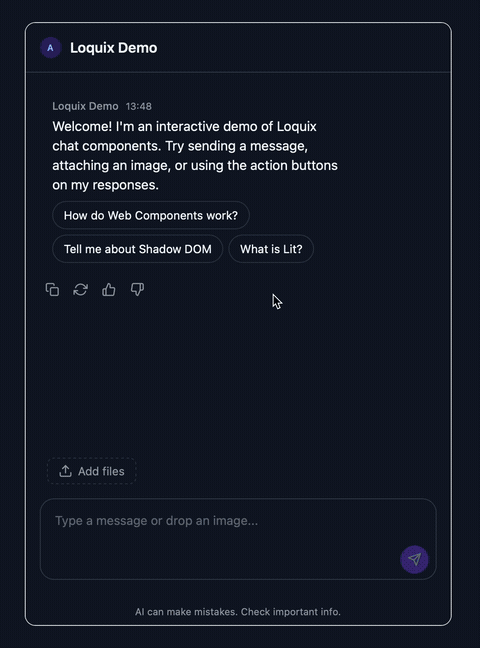

# Loquix

[](https://github.com/loquix-dev/loquix/actions/workflows/ci.yml)
[](https://codecov.io/gh/loquix-dev/loquix)
[](LICENSE)


**Web Components for AI Chat Interfaces**

A framework-agnostic UI kit of 35 production-ready components for building AI and LLM chat interfaces. Built with [Lit](https://lit.dev/) 3.x, TypeScript strict mode, and Shadow DOM encapsulation.

<p align="center">
  
</p>

## Why Loquix

Every team building an AI product ends up implementing the same chat UI from scratch: message bubbles, streaming indicators, file uploads, model selectors, feedback buttons, parameter panels. It takes weeks of work, and the result is rarely accessible or themeable.

Loquix provides a complete set of composable Web Components that cover the entire AI chat experience. Drop in a `<loquix-chat-container>` with a message list, composer, and header — and you have a full-featured chat UI with streaming support, file attachments, inline editing, and user feedback out of the box.

Because these are standard Web Components, they work with any framework — or no framework at all.

The component library is the foundation. The long-term vision is a full ecosystem for building AI agents: additional theme packs, first-class bindings for React/Vue/Svelte/Angular, backend integrations with popular AI providers, and ready-made agent templates that combine all of these into deployable starting points.

## Getting Started

### Installation

```bash
npm install @loquix/core lit
```

### Import Components

Import the CSS variables and the components you need. Each `define/*` import auto-registers the custom element:

```js
import '@loquix/core/tokens/variables.css';

import '@loquix/core/define/define-chat-container';
import '@loquix/core/define/define-chat-header';
import '@loquix/core/define/define-message-list';
import '@loquix/core/define/define-message-item';
import '@loquix/core/define/define-message-content';
import '@loquix/core/define/define-chat-composer';
```

### Use in HTML

```html
<loquix-chat-container layout="full">
  <loquix-chat-header slot="header" agent-name="My Assistant"></loquix-chat-header>

  <loquix-message-list slot="messages">
    <loquix-message-item role="assistant" status="complete">
      <loquix-message-content>Hello! How can I help you?</loquix-message-content>
    </loquix-message-item>
  </loquix-message-list>

  <loquix-chat-composer slot="composer" placeholder="Type a message..."></loquix-chat-composer>
</loquix-chat-container>
```

### Listen for Events

```js
document.addEventListener('loquix-submit', e => {
  console.log('User sent:', e.detail.content);
});
```

### Theming

Apply a built-in theme or customize with CSS custom properties:

```css
@import '@loquix/core/tokens/themes/dark.css';

:root {
  --loquix-message-assistant-bg: #1e293b;
  --loquix-message-user-bg: #3b82f6;
  --loquix-input-border-radius: 12px;
}
```

### CDN

For quick prototyping without a bundler:

```html
<link rel="stylesheet" href="https://unpkg.com/@loquix/core/src/tokens/variables.css" />
<script src="https://unpkg.com/@loquix/core/cdn/loquix.min.js"></script>
```

### Class-Only Imports

If you need the class without auto-registration (e.g., for subclassing):

```js
import { LoquixChatContainer } from '@loquix/core/classes/loquix-chat-container';
```

### Storybook

The best way to explore all components, their properties, and variants is through Storybook:

```bash
pnpm storybook
```

Every component has interactive stories with controls for live property editing, slot composition examples, and accessibility checks built in.

## Recipes

### Streaming Chat

Handle a streaming AI response with a typing indicator and stop button:

```js
import '@loquix/core/define/define-message-item';
import '@loquix/core/define/define-message-content';
import '@loquix/core/define/define-typing-indicator';
import '@loquix/core/define/define-generation-controls';

const messageList = document.querySelector('loquix-message-list');
const composer = document.querySelector('loquix-chat-composer');

document.addEventListener('loquix-submit', async e => {
  const content = e.detail.content;

  // Add user message (use textContent to avoid XSS)
  const userMsg = document.createElement('loquix-message-item');
  userMsg.setAttribute('role', 'user');
  userMsg.setAttribute('status', 'complete');
  const userContent = document.createElement('loquix-message-content');
  userContent.textContent = content;
  userMsg.appendChild(userContent);
  messageList.appendChild(userMsg);

  // Add streaming assistant message
  const assistantMsg = document.createElement('loquix-message-item');
  assistantMsg.setAttribute('role', 'assistant');
  assistantMsg.setAttribute('status', 'streaming');
  const assistantContent = document.createElement('loquix-message-content');
  assistantContent.setAttribute('streaming-cursor', 'caret');
  assistantMsg.appendChild(assistantContent);
  messageList.appendChild(assistantMsg);

  // Set composer to streaming state (shows generation controls)
  composer.setAttribute('streaming', '');

  // Stream the response
  const response = await fetch('/api/chat', { method: 'POST', body: JSON.stringify({ content }) });
  const reader = response.body.getReader();
  const decoder = new TextDecoder();

  while (true) {
    const { done, value } = await reader.read();
    if (done) break;
    assistantContent.textContent += decoder.decode(value);
  }

  // Finalize
  assistantContent.removeAttribute('streaming-cursor');
  assistantMsg.setAttribute('status', 'complete');
  composer.removeAttribute('streaming');
});

// Handle stop
document.addEventListener('loquix-stop', () => {
  // Abort the stream, mark message as complete
});
```

### File Upload Chat

Add file attachments with drag-and-drop and paste support (drag-and-drop is handled by the composer):

```html
<loquix-chat-composer slot="composer" placeholder="Type a message...">
  <loquix-attachment-panel
    slot="toolbar-top"
    accepted-types="image/*,.pdf,.txt"
    max-size="10485760"
    max-files="5"
  ></loquix-attachment-panel>
</loquix-chat-composer>
```

```js
import '@loquix/core/define/define-attachment-panel';
import '@loquix/core/define/define-attachment-chip';
import '@loquix/core/define/define-message-attachments';

const panel = document.querySelector('loquix-attachment-panel');

// Track files added via button or paste
document.addEventListener('loquix-attachment-add', e => {
  console.log('Files attached:', e.detail.attachments);
});

// loquix-submit emits content only; read attachments from the panel
document.addEventListener('loquix-submit', e => {
  const content = e.detail.content;
  const attachments = panel.attachments; // current file list
  // Send content + attachments to your backend
});
```

### Model & Mode Selection

Let users choose between AI models and operating modes:

```html
<loquix-chat-header slot="header" agent-name="My Assistant">
  <loquix-model-selector slot="controls" value="gpt-4o"></loquix-model-selector>
  <loquix-mode-selector slot="mode-switcher" variant="tabs" value="chat"></loquix-mode-selector>
</loquix-chat-header>
```

```js
import '@loquix/core/define/define-model-selector';
import '@loquix/core/define/define-mode-selector';

const modelSelector = document.querySelector('loquix-model-selector');
modelSelector.models = [
  { value: 'gpt-4o', label: 'GPT-4o', tier: 'flagship', cost: '$5/1M tokens' },
  { value: 'claude-sonnet', label: 'Claude Sonnet', tier: 'balanced', cost: '$3/1M tokens' },
  { value: 'gpt-4o-mini', label: 'GPT-4o Mini', tier: 'fast', cost: '$0.15/1M tokens' },
];

const modeSelector = document.querySelector('loquix-mode-selector');
modeSelector.modes = [
  { value: 'chat', label: 'Chat', description: 'Free conversation' },
  { value: 'research', label: 'Research', description: 'Deep analysis with citations' },
  { value: 'code', label: 'Code', description: 'Programming assistant' },
];

document.addEventListener('loquix-model-change', e => {
  console.log('Model switched to:', e.detail.to);
});

document.addEventListener('loquix-mode-change', e => {
  console.log('Mode switched to:', e.detail.to);
});
```

## Features

### 35 Production-Ready Components

From message bubbles and avatars to model selectors and parameter tuning panels. Every component you need for a modern AI chat interface, designed to work together or independently.

### Streaming-First

Built for real-time AI responses. Streaming cursor variants (caret, block), animated typing indicators (dots, text, steps), and generation controls (stop, pause, resume) are first-class citizens, not afterthoughts.

### File Attachments

Complete file handling pipeline: drag-and-drop upload zones, progress tracking with status indicators, paste-to-upload from clipboard, MIME type validation, file size limits, and image previews with URL sanitization.

### Theming

Over 100 CSS custom properties (`--loquix-*`) for colors, spacing, typography, and component-specific tokens. Every component exposes `::part()` selectors for deep styling. Ships with light and dark themes.

### Event-Driven Architecture

All interactions emit typed, bubbling custom events that cross Shadow DOM boundaries (`composed: true`). Listen for `loquix-submit`, `loquix-feedback`, `loquix-model-change`, `loquix-attachment-add`, and more at any level of your application.

### Framework-Agnostic

Standard Web Components (Custom Elements v1) that work everywhere: vanilla JavaScript, React, Vue, Svelte, Angular, or any other framework. No adapters required — just HTML tags.

### Internationalization

Pluggable localization system via `LocalizeController`. Built-in English defaults with support for custom translation providers. Every user-facing string uses translatable term keys.

### TypeScript

Strict mode throughout. Full type definitions for all components, events, controllers, and data interfaces. IntelliSense and compile-time checks work out of the box.

## Components

| Category              | Components                                                                                    |
| --------------------- | --------------------------------------------------------------------------------------------- |
| **Chat Layout**       | `chat-container` `chat-header` `chat-composer` `composer-toolbar` `message-list`              |
| **Messages**          | `message-item` `message-content` `message-avatar` `message-actions` `message-attachments`     |
| **Actions**           | `action-button` `action-copy` `action-edit` `action-feedback`                                 |
| **Input & Selection** | `prompt-input` `dropdown-select` `suggestion-chips` `follow-up-suggestions` `example-gallery` |
| **AI Controls**       | `generation-controls` `typing-indicator` `mode-selector` `model-selector` `parameter-panel`   |
| **File Handling**     | `attachment-panel` `attachment-chip` `drop-zone`                                              |
| **Navigation & UI**   | `scroll-anchor` `nudge-banner` `caveat-notice` `disclosure-badge` `filter-bar`                |
| **Templates**         | `template-card` `template-picker` `welcome-screen`                                            |

All components use the `loquix-` prefix (e.g., `<loquix-chat-container>`).

## Accessibility

Loquix targets **WCAG 2.1 Level AA** compliance. Every component is checked against [axe-core](https://github.com/dequelabs/axe-core) rules via the `@storybook/addon-a11y` integration.

**Keyboard Navigation** — Full keyboard support in every interactive component. Tab between elements, arrow keys for lists and dropdowns, Enter/Space for activation, Escape to dismiss.

**ARIA Semantics** — Proper use of `aria-label`, `aria-pressed`, `aria-expanded`, `aria-selected`, and semantic roles (`toolbar`, `listbox`, `status`, `note`, `banner`) throughout.

**Focus Management** — Native `<dialog>` for modals with built-in focus trapping. Auto-focus on search inputs when dropdowns open.

**Screen Reader Support** — Semantic HTML structure with appropriate heading hierarchy, live regions for streaming content updates, and meaningful labels for all interactive controls.

## Contributing

Contributions are welcome. Here's how to get started:

```bash
git clone https://github.com/loquix-dev/loquix.git
cd loquix
pnpm install
pnpm storybook   # develop with live preview
pnpm test         # run tests (Chromium + WebKit)
pnpm build        # build the library
```

**Project structure:**

- `packages/core/src/components/core/` — components (`loquix-*.ts`, `*.styles.ts`, `*.test.ts`)
- `packages/core/src/controllers/` — shared controllers (keyboard, resize, autoscroll)
- `packages/core/src/events/` — typed event definitions
- `packages/core/src/tokens/` — CSS custom properties and themes
- `docs/` — Storybook stories and documentation

**Conventions:**

- Each component is a single `loquix-*.ts` file with a separate `.styles.ts` and `.test.ts`
- Registration happens in `define-*.ts` files with `customElements.get()` guard
- Events use `loquix-` prefix, `bubbles: true`, `composed: true`
- CSS variables use `--loquix-` prefix
- All tests must pass on both Chromium and WebKit before merging

## Roadmap

Development is organized into phases, from core chat primitives to advanced AI interaction patterns.

### Phase 1 — Core

- [x] `chat-container` — layout shell (full, panel, floating, inline)
- [x] `chat-header` — agent identity, controls, mode switcher slots
- [x] `message-list` — scrollable message container with auto-scroll
- [x] `message-item` — message unit (user, assistant, system, tool roles)
- [x] `message-content` — markdown, code blocks, streaming cursor
- [x] `message-avatar` — icon, image, initials, animated variants
- [x] `message-actions` — hover/focus action toolbar (copy, edit, feedback)
- [x] `chat-composer` — input area with slots for toolbars, suggestions, controls
- [x] `prompt-input` — textarea with auto-resize, submit-on-enter
- [x] `generation-controls` — stop, pause, resume, skip buttons
- [x] `typing-indicator` — dots, text, steps variants
- [x] `disclosure-badge` — AI-generated content marker
- [x] `caveat-notice` — model limitation warnings
- [x] Design tokens — 100+ CSS custom properties (`--loquix-*`)
- [x] Light and dark themes
- [x] Event system — typed bubbling events (`loquix-*`, `composed: true`)
- [x] TypeScript strict mode with full type definitions

### Phase 2 — Onboarding & Navigation

- [x] `welcome-screen` — initial CTA with slots for suggestions, gallery, templates
- [x] `suggestion-chips` — static, contextual, adaptive, follow-up variants
- [x] `follow-up-suggestions` — post-response continuation prompts
- [x] `template-picker` — template selection dialog with categories and search
- [x] `template-card` — single template card with variables
- [x] `example-gallery` — curated, community, dynamic example showcases
- [x] `nudge-banner` — inline, toast, banner, floating-button variants

### Phase 3 — Configuration & Attachments

- [x] `mode-selector` — tabs, dropdown, toggle, pills variants
- [x] `model-selector` — model picker with tiers, costs, capabilities
- [x] `attachment-panel` — file upload with paste, MIME validation
- [x] `attachment-chip` — file preview with type icon and removal
- [x] `parameter-panel` — temperature, tokens, presets, advanced controls
- [x] `filter-bar` — source filters and negative prompting
- [ ] `voice-tone-selector` — tone presets with global/project/session scoping

### Phase 4 — Control & Transparency

- [ ] `stream-of-thought` — real-time AI reasoning display (plan, tool calls, decisions)
- [ ] `action-plan` — step list before execution (advisory and contractual variants)
- [ ] `verification-dialog` — confirmation for risky/destructive actions with cost estimates
- [ ] `citation-inline` — superscript, highlight, badge inline source annotations
- [ ] `references-panel` — aggregated source list (panel, aside, nested variants)
- [ ] `variations-carousel` — multiple response variants with diff highlighting
- [ ] `branches-nav` — conversation branch tree navigation

### Phase 5 — Advanced

- [ ] `memory-panel` — AI memory management (global/project/session scoping)
- [ ] `prompt-enhancer` — pre-send prompt improvement with diff view
- [ ] `inline-action-toolbar` — contextual toolbar on text selection (expand, shorten, translate)
- [ ] `connector-selector` — external data source connections
- [ ] `incognito-indicator` — privacy mode status badge
- [ ] `cost-estimate` — token/credit cost display with breakdowns
- [ ] `session-history` — conversation history sidebar with search
- [ ] `prompt-details` — system prompt and context transparency panel

### Ecosystem (coming soon)

Detailed plans for these packages will be published as the core library stabilizes.

- [ ] Theme packs — additional prebuilt themes beyond light/dark
- [x] `@loquix/react` — React wrappers with hooks and context providers
- [ ] `@loquix/vue` — Vue bindings with composables
- [ ] `@loquix/svelte` — Svelte component wrappers
- [ ] Provider integrations — prebuilt adapters for OpenAI, Anthropic, Google, and other AI services
- [ ] Agent templates — full-stack starter kits that combine components, providers, and backend into deployable agents
- [ ] Documentation site — full API reference, guides, and tutorials beyond Storybook

### Infrastructure (complete)

- [x] Lit 3.x with Shadow DOM encapsulation
- [x] Shared controllers — keyboard, resize, autoscroll, streaming, upload, agent
- [x] i18n — `LocalizeController` with pluggable translation providers
- [x] Storybook — interactive stories with `@storybook/addon-a11y` (axe-core)
- [x] Test suite — 896 tests on Chromium + WebKit via Web Test Runner
- [x] CDN bundle — single-file IIFE build for prototyping
- [x] Custom Elements Manifest — machine-readable component metadata
- [x] Vite library build with multi-entry exports

## License

MIT
